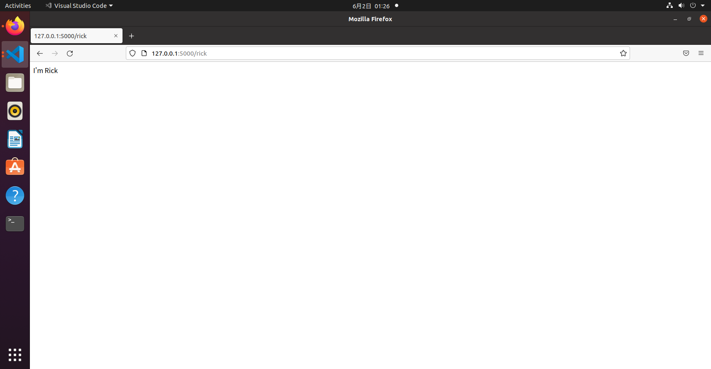
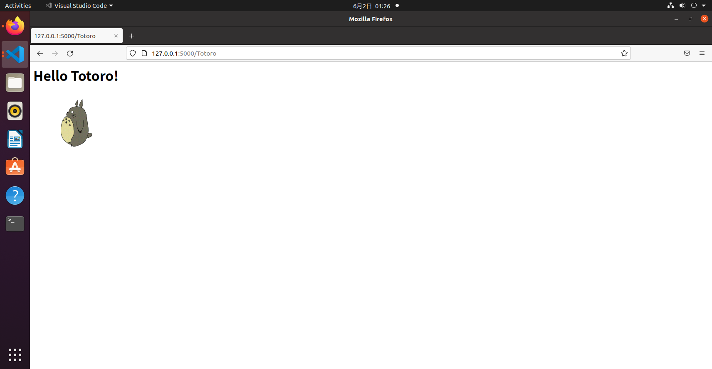
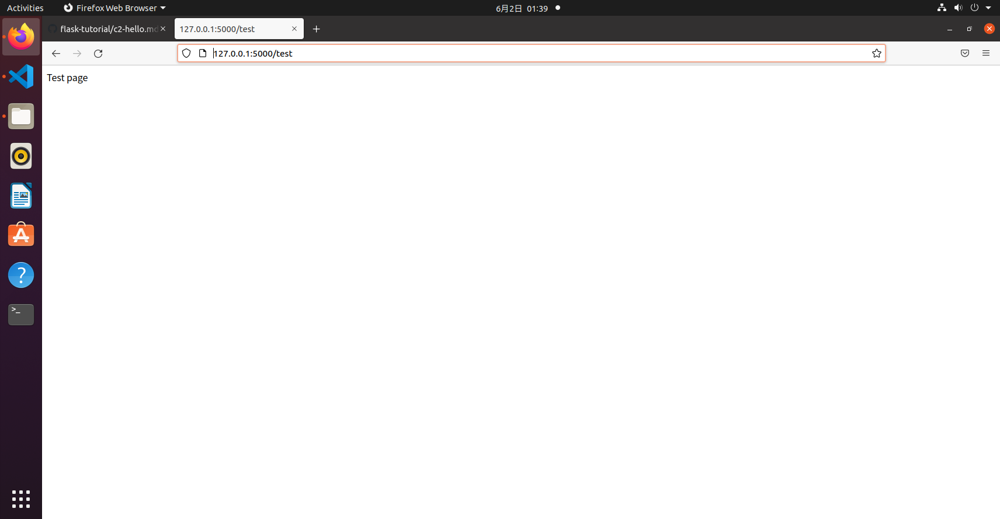

## CH1 Hello, Flask!
 * app.py
 ```python
 from flask import Flask
from flask import escape

app = Flask(__name__)

@app.route('/rick')
def Rick():
    return "I'm Rick"

@app.route('/Totoro')
@app.route('/')
def Totoro():
    return '<h1>Hello Totoro!</h1>'
@app.route('/user/<name>')
def user_page(name):
    return 'user:%s'%escape(name)

@app.route('/test')
def test_url_for():
    # 下面是一些调用示例（请在命令行窗口查看输出的 URL）：
    print(url_for('Rick'))  # 输出：/rick
    print(url_for('Totoro')) # 输出：/
    # 注意下面两个调用是如何生成包含 URL 变量的 URL 的
    print(url_for('user_page', name='greyli'))  # 输出：/user/greyli
    print(url_for('user_page', name='peter'))  # 输出：/user/peter
    print(url_for('test_url_for'))  # 输出：/test
    # 下面这个调用传入了多余的关键字参数，它们会被作为查询字符串附加到 URL 后面。
    print(url_for('test_url_for', num=2))  # 输出：/test?num=2
    return 'Test page'
 ```
 ### result
 * hello
 

 * home and Totoro
 
 

 * user page
 

* test

